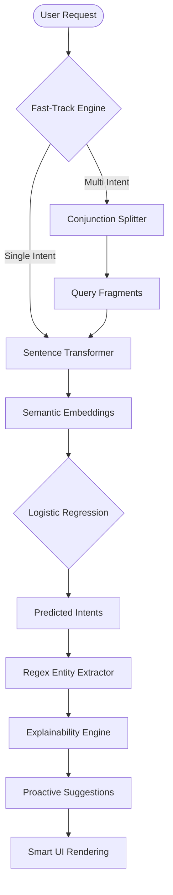

# 🏦 Agentic Banking Assistant: Intelligence-Driven Intent Platform

[](https://www.python.org/)
[](https://fastapi.tiangolo.com/)
[](https://scikit-learn.org/)
[](https://www.nltk.org/)

A production-grade NLP platform designed for the next generation of Fintech. This system provides a robust, explainable, and proactive layer for understanding complex customer banking requests.

---

## 🎯 Project Overview

Traditional banking chatbots often struggle with **Complex Multi-Step Queries**. Our system identifies single or multiple intents from a single user string, extracts critical financial entities, and provides an explainable reasoning layer for every action.

### 🚀 Key Innovations
- **Fast-Track Decision Engine**: Zero-latency prediction for simple queries by bypassing the multi-intent splitter.
- **Multi-Intent Decomposition**: Automatically breaks down complex sentences like *"Pay 500 to Rahul and check my balance"* into separate actionable tasks.
- **Explainable AI (XAI)**: Every prediction is enriched with technical reasoning and suggested strategies from a curated knowledge base.

---

## 🏗️ System Architecture

The following diagram illustrates the flow from raw user input to the final intelligence-enriched output.



---

## 🛠️ Technology Stack

| Layer | Technology | Purpose |
| :--- | :--- | :--- |
| **Orchestration** | `FastAPI` | Asynchronous high-performance API serving. |
| **Embeddings** | `all-MiniLM-L6-v2` | Generating 384-dimensional semantic vectors. |
| **Classifier** | `Logistic Regression` | High-accuracy intent classification (Scikit-Learn). |
| **Extraction** | `Regex / NLTK` | Rule-based entity parsing (Amounts, Receivers, Limits). |
| **Frontend** | `Streamlit / Vanilla JS` | Proactive dashboard and lightweight web interface. |
| **Persistence** | `Pandas / CSV` | Audit logging and analytics. |

---

## 🌟 Visual Showcase

- **Real-Time Analytics**: Monitor classification confidence and intent distribution.
- **Proactive Prompts**: The system suggests the "Next Best Action" (e.g., suggesting a balance check after a transfer).
- **Entity Mastery**: Precise extraction of transaction amounts and recipient names even in unstructured text.

---

## 📂 Project Structure

```text
intent-classifier-system/
├── api/                 # FastAPI Implementation
│   ├── app.py           # Core System Logic
│   ├── main.py          # API Server Entry
│   ├── routes.py        # Prediction & Health Endpoints
│   └── schemas.py       # Pydantic Data Models
├── data/                # Knowledge & Data Layer
│   ├── dataset.csv      # Unified Training Data
│   └── intent_knowledge.json # Explainability Base
├── logs/                # Audit & Analytics
│   └── predictions.csv  # Interaction History
├── model/               # Machine Learning Engine
│   ├── train.py         # Modular training pipeline
│   ├── predict.py       # Prediction Orchestrator
│   ├── model.pkl        # Logistic Regression Classifier
│   └── encoder.pkl      # Transformer Metadata
├── ui/                  # Advanced Frontends
│   ├── app.py           # Streamlit Dashboard
│   └── static/          # Web dashboard (HTML/CSS/JS)
├── utils/               # Logic Utilities
│   ├── multi_intent.py  # Fast-Track & Splitting Engine
│   ├── entities.py      # Entity Extraction Logic
│   ├── loaders.py       # Resource Loading Utilities
│   ├── logger.py        # Persistent Auditing
│   └── preprocessing.py # NLTK Text Sanitization
├── main.py              # Unified System Orchestrator
└── requirements.txt     # Dependency Management
```

---

## 🚀 Future Roadmap

We are continuously evolving the system to meet the demands of modern banking.

1.  **Transformer-Based NER**: Integrating HuggingFace `token-classification` models for more robust entity detection across diverse naming conventions.
2.  **Voice-to-Intent**: Adding a speech recognition layer (Whisper API) for hands-free interactions.
3.  **Multilingual Expansion**: Supporting regional languages by leveraging multi-lingual encoders like `LaBSE`.
4.  **Security Hardening**: Implementing JWT-based authentication and end-to-end encryption for API payloads.
5.  **Sandbox Integration**: Connecting the "Suggested Actions" to mock banking APIs (like Plaid) for a full end-to-end simulation.

---

## ⚡ Getting Started

### 1. Setup Environment
```powershell
pip install -r requirements.txt
```

### 2. Train the Model
```powershell
python model/train.py
```

### 3. Run the Platform
```powershell
python main.py
```

Access the **Web Dashboard** at `http://localhost:8000` or the **API Docs** at `http://localhost:8000/docs`.

---
**Crafted with ❤️ for the future of Fintech.**

